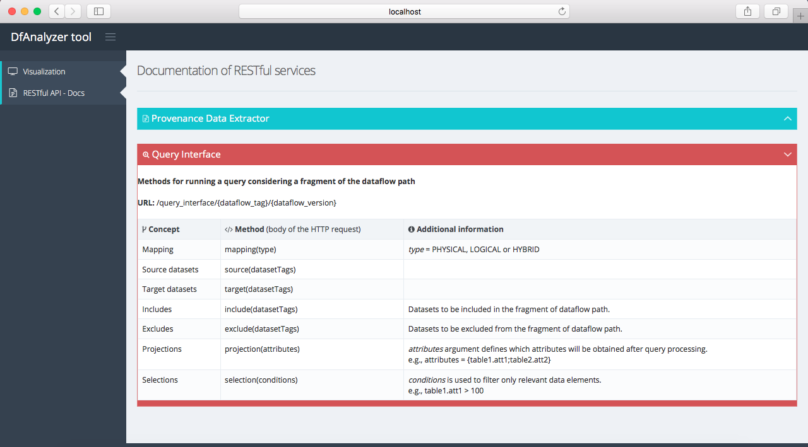

# Spark application using DfAnalyzer tool
***

## Overview

This repository presents the configuration and execution of a Spark application using DfAnalyzer tool for enabling monitoring, debugging, steering, and analysis of the dataflow path at runtime. More specifically, DfAnalyzer provides file and data element flow analyses based on a dataflow abstraction. More information about the components of DfAnalyzer can be found [here](https://hpcdb.github.io/armful/dfanalyzer.html).

## Software Requirements

This demonstration requires the installation of three softwares to run DfAnalyzer tool with our Spark application. Users can also install the FastBit tool in order to apply a bitmap indexing technique in scientific data produced by our application and stored in raw data files.

1. [Java SE Development Kit (JDK)](http://www.oracle.com/technetwork/java/javase/downloads/index.html), which can be installed following the steps provided by Oracle Corporation;
2. [Apache Spark](http://spark.apache.org/), a large-scale data processing engine.
3. [MonetDB](https://www.monetdb.org/Home), column-oriented database management system (DBMS). It can be installed and configured following the [user guide](https://www.monetdb.org/Documentation/UserGuide) provided on MonetDB's website.
4. [FastBit](https://sdm.lbl.gov/fastbit/), a bitmap-based indexing tool. **(optional)**

## About this repository

In this repository, we provide a compressed file of our MonetDB database (to DfAnalyzer) and configuration files of Spark already defined for a local execution of an application. Therefore, users only need to configure some environment variables (as discussed in the next section) and run two scripts, `start-dfa.sh` and `run-spark-app.sh`. Moreover, we assume that experiments are being executed in an Unix-based operating system.

## Environment configuration

After the software installation step, users have to define some environment variables and others in the `PATH` variable of the operating system.

To configure Spark environment variables, users have to specify the path to Spark installation directory (variable `SPARK_HOME`), the directory *sbin* (variable `SPARK_SBIN`), the configuration directory (variable `SPARK_CONF_DIR`), and they have to add directory *bin* to the environment variable `PATH`, as follows:

```
export SPARK_HOME=/program/spark-2.2.0-bin-hadoop2.7
export SPARK_SBIN=$SPARK_HOME/sbin
export SPARK_CONF_DIR=$SPARK_HOME/conf
export PATH=$PATH:$SPARK_HOME/bin
```

To configure MonetDB in the operating system, users have to add the binary directory of this DBMS to the environment variable `PATH`, as follows:

```
export MONETDB=/program/monetdb
export PATH=$PATH:$MONETDB/bin
```

To configure FastBit in the operating system, users have to add the binary directory of this indexing tool to the environment variable `PATH`, as follows:

```
export FASTBIT=/program/fastbit-2.0.2
PATH=$PATH:$FASTBIT/bin
```

## Starting DfAnalyzer tool

After environment configuration, RESTful services of DfAnalyzer tool can be initialized by invoking the script `start-dfa.sh` in a terminal tab, as follows:

```
cd $ROOT_DIRECTORY_OF_THE_REPOSITORY
./start-dfa.sh
```

Then, a similar output message should be displayed in the terminal tab:

```
Setting up environment variables
--------------------------------------------
Removing data from previous executions
--------------------------------------------
Configuring DfA.properties file
--------------------------------------------
Restoring MonetDB database...
--------------------------------------------
Starting database system...
property            value
hostname         localhost
dbfarm           /app/dfanalyzer-spark/data
status           monetdbd[3068] 1.7 (Jul2017-SP1) is serving this dbfarm
mserver          /program/monetdb/bin/mserver5
logfile          /app/dfanalyzer-spark/data/merovingian.log
pidfile          /app/dfanalyzer-spark/data/merovingian.pid
sockdir          /tmp
listenaddr       localhost
port             50000
exittimeout      60
forward          proxy
discovery        true
discoveryttl     600
control          no
passphrase       <unknown>
mapisock         /tmp/.s.monetdb.50000
controlsock      /tmp/.s.merovingian.50000
starting database 'dataflow_analyzer'... done
      name         state   health                       remarks
dataflow_analyzer  R  0s  100% 11s  mapi:monetdb://localhost:50000/dataflow_analyzer
--------------------------------------------
Starting DfA RESTful API

  .   ____          _            __ _ _
 /\\ / ___'_ __ _ _(_)_ __  __ _ \ \ \ \
( ( )\___ | '_ | '_| | '_ \/ _` | \ \ \ \
 \\/  ___)| |_)| | | | | || (_| |  ) ) ) )
  '  |____| .__|_| |_|_| |_\__, | / / / /
 =========|_|==============|___/=/_/_/_/
 :: Spring Boot ::        (v1.5.8.RELEASE)

2017-11-09 09:12:44.451  INFO 3073 --- [           main] rest.server.WebApplication               : Starting WebApplication v1.0 on mercedes with PID 3073 (/app/dfanalyzer-spark/dfa/REST-DfA-1.0 started by vitor in /app/dfanalyzer-spark)
...
2017-11-09 09:12:55.397  INFO 3073 --- [           main] o.s.j.e.a.AnnotationMBeanExporter        : Registering beans for JMX exposure on startup
2017-11-09 09:12:55.419  INFO 3073 --- [           main] o.s.c.support.DefaultLifecycleProcessor  : Starting beans in phase 0
2017-11-09 09:12:55.815  INFO 3073 --- [           main] s.b.c.e.t.TomcatEmbeddedServletContainer : Tomcat started on port(s): 22000 (http)
2017-11-09 09:12:55.833  INFO 3073 --- [           main] rest.server.WebApplication               : Started WebApplication in 12.433 seconds (JVM running for 13.257)
```

## Running Spark application

Since DfAnalyzer tool is online, Spark application (script `run-spark-app.sh`) can be invoked in another terminal tab, as follows:

```
cd $ROOT_DIRECTORY_OF_THE_REPOSITORY
./run-spark-app.sh
```

Then, a similar output message should be displayed in the terminal tab:

```
Setting up environment variables
-------------------------------------------------
Removing files from previous executions
-------------------------------------------------
Configuring property file for Spark application
-------------------------------------------------
Configuring Spark
-------------------------------------------------
Stopping Spark master and workers
localhost: stopping org.apache.spark.deploy.worker.Worker
stopping org.apache.spark.deploy.master.Master
-------------------------------------------------
Starting Spark master and workers
-------------------------------------------------
Submiting dataflow specification
...
-------------------------------------------------
Submiting a Spark application
# Initializing dataflow
# Transformation 0 - Loading customer lists into RDD
# Transformation 1 - Deduplication
# Transformation 2 - Filter by countries                                        
 --> united states
 --> europe
# Transformation 3 - Union of tuples from United States and Europe
# Transformation 4 - Cartesian product of customers with cloth items
 --> loading cloth items into RDD
 --> cartesian product
# Transformation 5 - Prediction                                                 
 --> loading buying patterns into RDD
 --> prediction
# Transformation 6 - Aggregation                                                
# End                                                                           
-------------------------------------------------
```
## Web application 
### DfViewer component

Besides the execution of a Spark application using DfAnalyzer, our RESTful application also provides a dataflow visualization based on a dataset perspective view. So, when users access DfAnalyzer in a web browser (*e.g.*, using the URL `http://localhost:22000`), they can visualize dataflow specifications already stored in DfAnalyzer's database, as shown in the following figure.


***

### DfAnalyzer RESTful documentation

Our web application also provides a documentation with details about the resources delivered by our RESTful API for extracting provenance and scientific data from scientific applications (*e.g.*, Spark application), and running queries in DfAnalyzer's database during the execution of scientific applications.

#### Provenance Data Extractor documentation 

More details about Provenance Data Extractor (PDE) are shown when the ribbon with the same name is expanded, as follows:


#### Query Interface documentation

More details about Query Interface (QI) are shown when the ribbon with the same name is expanded, as follows:



## Dataflow analysis using Query Interface

To perform dataflow analysis, an HTTP request has to be submitted to the RESTful API of DfAnalyzer considering the aforementioned documentation of QI. 

For instance, according to the dataflow representation (in the dataset perspective view) our Spark application, users might like to investigate the data element flow from the input dataset *icloth_item* to the output dataset *oaggregation*, when the probability of a customer to buy a cloth item is less than 0.50. More specifically, they want to know which cloth items are in this situation and how many of them will be sold.


Based on this dataflow analysis, an HTTP request has to be submitted to our RESTful API with the following URL and message (*i.e.*, HTTP body).

URL:
`http://localhost:22000/query_interface/{dataflow_tag}/{dataflow_id}` (*e.g.*, `http://localhost:22000/query_interface/clothing/2` 

Message:

```
mapping(logical)
source(icloth_item)
target(oaggregation)
projection(icloth_item.clothid;icloth_item.description;
			oprediction.probability;oaggregation.quantity)
selection(oprediction.probability < 0.50)
```

As a result, our RESTful API returns a CSV-format file with the following content:

```
"clothid";"description";"probability";"quantity"
"3";"clothing-3";"0.45";"1200"
"4";"clothing-4";"0.2";"1161"
"8";"clothing-8";"0.45";"1242"
"4";"clothing-4";"0.4";"1161"
"4";"clothing-4";"0.45";"1161"
"8";"clothing-8";"0";"1242"
"1";"clothing-1";"0.45";"1606"
"2";"clothing-2";"0.45";"1756"
```

## Source codes

Besides an application execution, we provide the instrumented source code of our Spark application using DfAnalyzer tool in the directory *Clothing-Spark*. Therefore, users can investigate this source code to understand our instrumentation strategy using DfAnalyzer tool. 

We also encourage users to develop their own application using DfAnalyzer or modify our Spark application. In the latter case, it is necessary to install [Apache Maven](https://maven.apache.org/) if users would like to build their modified application.

To build the project with Spark application, it is necessary to run the following command line:

```
mvn clean package
```


## Acknowledgements

We thank Thaylon Guedes for his help in developing the graphical interface of our Web application. Authors also would like to thank CAPES, CNPq, FAPERJ, HPC4E (EU H2020 Programme and MCTI/RNP-Brazil, grant no. 689772), and Intel for partially funding this work.
